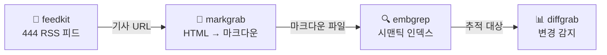

# newswatch

> [English](README.md)

**뉴스 모니터링 파이프라인** — RSS 피드 수집, 전문 추출, 시맨틱 검색, 페이지 변경 추적. [QuartzUnit](https://github.com/QuartzUnit) 라이브러리로만 구축.



## 빠른 시작

```bash
pip install newswatch

# 내장 카탈로그에서 기술 피드 구독
newswatch setup -c technology

# 전체 파이프라인 실행: 수집 → 추출 → 인덱싱
newswatch run

# 수집된 기사에서 의미 기반 검색
newswatch search "kubernetes scaling strategies"
```

## 동작 과정

1. **수집** — [feedkit](https://github.com/QuartzUnit/feedkit)으로 RSS/Atom 피드 구독 (444개 검증 피드 내장)
2. **추출** — [markgrab](https://github.com/QuartzUnit/markgrab)으로 기사 전문 추출 (HTML → 마크다운)
3. **인덱싱** — [embgrep](https://github.com/QuartzUnit/embgrep)으로 로컬 시맨틱 검색 인덱스 구축 (API 키 불필요)
4. **추적** — [diffgrab](https://github.com/QuartzUnit/diffgrab)으로 페이지 변경 감지 (구조화된 diff)

클라우드 서비스 없음, API 키 없음. 모든 것이 로컬에서 실행됩니다.

## CLI

```bash
# 피드 구독
newswatch setup -c technology              # 기술 피드 68개
newswatch setup -c science -c finance      # 복수 카테고리
newswatch setup -f https://example.com/rss # 개별 URL

# 파이프라인 실행
newswatch run                              # 수집 → 추출 → 인덱싱
newswatch run -n 100                       # 최대 100개 기사 추출
newswatch run -t https://example.com       # 페이지 변경 추적 포함

# 시맨틱 검색
newswatch search "AI regulation in Europe"
newswatch search "supply chain attacks" -n 10
```

## Python API

```python
import asyncio
from newswatch import NewsPipeline

async def main():
    pipeline = NewsPipeline()

    # 피드 구독
    await pipeline.setup(categories=["technology", "science"])

    # 전체 파이프라인 실행
    result = await pipeline.run(extract_limit=100)
    print(f"{result.articles_new} new, {result.articles_indexed} indexed")

    # 시맨틱 검색
    results = pipeline.search("quantum computing breakthroughs")
    for r in results:
        print(f"  [{r['score']}] {r['text'][:80]}")

    pipeline.close()

asyncio.run(main())
```

## 사용된 QuartzUnit 라이브러리

| 라이브러리 | newswatch에서의 역할 | PyPI |
|-----------|---------------------|------|
| [feedkit](https://github.com/QuartzUnit/feedkit) | RSS/Atom 피드 수집 (444개 검증 피드) | `pip install feedkit` |
| [markgrab](https://github.com/QuartzUnit/markgrab) | URL → LLM-ready 마크다운 추출 | `pip install markgrab` |
| [embgrep](https://github.com/QuartzUnit/embgrep) | 로컬 시맨틱 검색 (fastembed + SQLite) | `pip install embgrep` |
| [diffgrab](https://github.com/QuartzUnit/diffgrab) | 웹 페이지 변경 추적 + 구조화된 diff | `pip install diffgrab` |

## 라이선스

[MIT](LICENSE)
