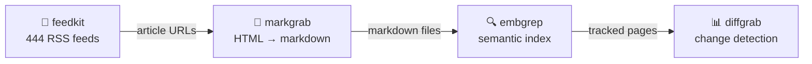
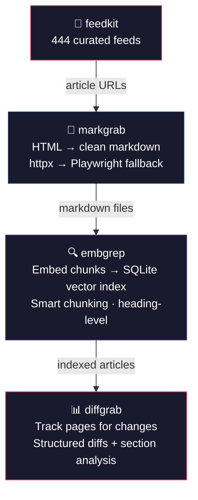

# newswatch

> [한국어 문서](README.ko.md) · [llms.txt](llms.txt)

**News monitoring pipeline** — collect RSS feeds, extract full articles, search by meaning, and track page changes. Built entirely from [QuartzUnit](https://github.com/QuartzUnit) libraries.



## Quick Start

```bash
pip install newswatch

# Subscribe to tech feeds from the built-in catalog
newswatch setup -c technology

# Run the full pipeline: collect → extract → index
newswatch run

# Search collected articles by meaning
newswatch search "kubernetes scaling strategies"
```

## What It Does

1. **Collect** — Subscribes to RSS/Atom feeds via [feedkit](https://github.com/QuartzUnit/feedkit) (444 curated feeds built-in)
2. **Extract** — Fetches full article content via [markgrab](https://github.com/QuartzUnit/markgrab) (HTML → clean markdown)
3. **Index** — Builds a local semantic search index via [embgrep](https://github.com/QuartzUnit/embgrep) (embedding-powered, no API keys)
4. **Track** — Monitors pages for changes via [diffgrab](https://github.com/QuartzUnit/diffgrab) (structured diffs)

No cloud services, no API keys. Everything runs locally.

## CLI

### `newswatch setup`

Subscribe to feeds.

```bash
newswatch setup -c technology              # all 68 tech feeds
newswatch setup -c science -c finance      # multiple categories
newswatch setup -f https://example.com/rss # individual URL
```

### `newswatch run`

Run the full pipeline.

```bash
newswatch run                              # collect → extract → index
newswatch run -n 100                       # extract up to 100 articles
newswatch run -t https://example.com       # also track this page for changes
```

Output:
```
Running newswatch pipeline...

        Pipeline Results
┌─────────────────────┬────────┐
│ Step                │ Result │
├─────────────────────┼────────┤
│ Feeds collected     │     62 │
│ New articles        │    418 │
│ Articles extracted  │     50 │
│ Articles indexed    │     50 │
└─────────────────────┴────────┘
```

### `newswatch search`

Semantic search across collected articles.

```bash
newswatch search "AI regulation in Europe"
newswatch search "supply chain attacks" -n 10
```

## Python API

```python
import asyncio
from newswatch import NewsPipeline

async def main():
    pipeline = NewsPipeline()

    # Subscribe to feeds
    await pipeline.setup(categories=["technology", "science"])

    # Run full pipeline
    result = await pipeline.run(extract_limit=100)
    print(f"{result.articles_new} new, {result.articles_indexed} indexed")

    # Semantic search
    results = pipeline.search("quantum computing breakthroughs")
    for r in results:
        print(f"  [{r['score']}] {r['text'][:80]}")

    pipeline.close()

asyncio.run(main())
```

## How It Works



## Configuration

Data is stored in `~/.newswatch/` by default:

```
~/.newswatch/
├── feeds.db       # feedkit subscriptions + articles
├── index.db       # embgrep semantic index
├── tracker.db     # diffgrab snapshots
└── extracted/     # markgrab markdown output
```

Custom location:

```python
pipeline = NewsPipeline(db_dir="/path/to/data")
```

## QuartzUnit Libraries Used

| Library | Role in newswatch | PyPI |
|---------|-------------------|------|
| [feedkit](https://github.com/QuartzUnit/feedkit) | RSS/Atom feed collection (444 curated feeds) | `pip install feedkit` |
| [markgrab](https://github.com/QuartzUnit/markgrab) | URL → LLM-ready markdown extraction | `pip install markgrab` |
| [embgrep](https://github.com/QuartzUnit/embgrep) | Local semantic search (fastembed + SQLite) | `pip install embgrep` |
| [diffgrab](https://github.com/QuartzUnit/diffgrab) | Web page change tracking + structured diffs | `pip install diffgrab` |

## License

[MIT](LICENSE)
